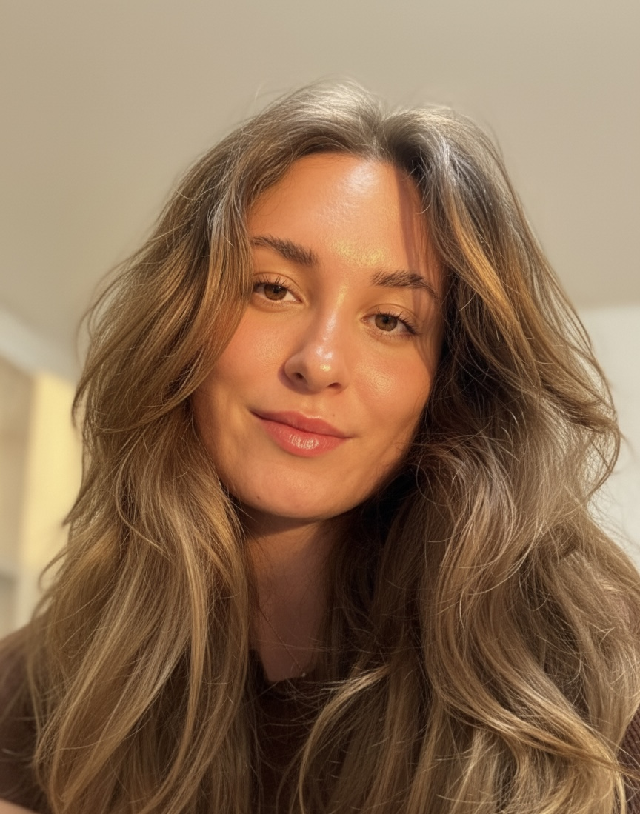

<!DOCTYPE html>
<html lang="ru">
<head>
    <meta charset="UTF-8">
    <meta name="viewport" content="width=device-width, initial-scale=1.0">
    <title>Василиса | Психолог & Сексолог</title>
    <link href="https://fonts.googleapis.com/css2?family=Playfair+Display:wght@400;700&family=Montserrat:wght@300;400;500&display=swap" rel="stylesheet">
    
</head>
<body>

    <header>
        
        <h1>Василиса</h1>
        
Бережное пространство для твоей честности, глубины и удовольствия [cite: 1, 4-5].

    </header>

    

        
        

            

                <h2>С чем я работаю</h2>
                <ul>
                    <li>Самооценка и самоценность [cite: 1, 7]</li>
                    <li>Тревожность, страхи, напряжение [cite: 1, 8]</li>
                    <li>Сложности в отношениях (всех видов) [cite: 1, 9]</li>
                    <li>Выгорание и поиск смыслов [cite: 1, 9]</li>
                </ul>
            

            

                <h2>Темы сексуальности</h2>
                <ul>
                    <li>Либидо и желание [cite: 1, 16]</li>
                    <li>Боли, стыд, блоки и телесные зажимы [cite: 1, 17]</li>
                    <li>Вопрос оргазма и удовольствия [cite: 1, 18]</li>
                    <li>Сложности диалога с партнером [cite: 1, 19]</li>
                </ul>
            

        

        
Мой подход: без морали и «правильных» ответов. Только поддержка и бережность к твоему темпу[cite: 1, 11].

        <h2>Образование</h2>
        
<strong>Высшее психологическое:</strong> Диплом Бакалавра с отличием («Красный Диплом») [cite: 1, 56-57].

        
<strong>Мировой опыт:</strong> Сертификаты Copenhagen Business School (Дания) и University of Chicago (США)[cite: 1, 87, 95].

        
        

            
            
        

        <h2>Формат и стоимость</h2>
        

            

                

                    <h3>Разовая сессия</h3>
                    
60 минут — <strong>3 000 ₽</strong> [cite: 1, 23, 34]

                    <small>Онлайн (Яндекс Телемост) + связь в чате [cite: 1, 21-25]</small>
                

                

                    <h3>Пакет из 4 сессий</h3>
                    
12 000 ₽ <strong>10 000 ₽</strong> [cite: 1, 40]

                    Выгода 2 000 ₽
                

            

            

                <strong>Правила записи:</strong>
                <ul>
                    <li>Предоплата 100% [cite: 1, 28]</li>
                    <li>Отмена не позже, чем за 24 часа [cite: 1, 30]</li>
                    <li>Опоздание >10 мин = сессия проведена [cite: 1, 31]</li>
                    <li>Частота: не реже 1 раза в 2 недели [cite: 1, 32]</li>
                </ul>
            

        

        

            <a href="https://t.me/vasilisa_potapova" class="btn">ЗАПИСАТЬСЯ НА СЕССИЮ</a> 
            <a href="https://t.me/vazilissaa" class="btn btn-secondary">МОЙ TELEGRAM-КАНАЛ</a>
        

    

</body>
</html>
